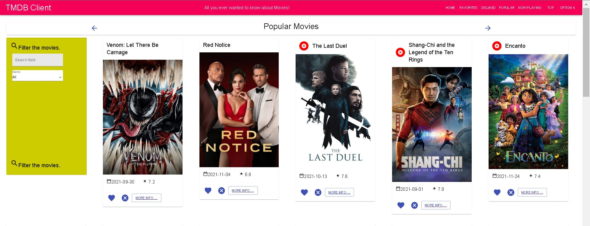
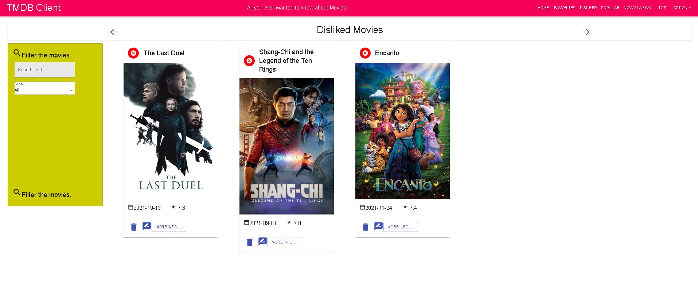
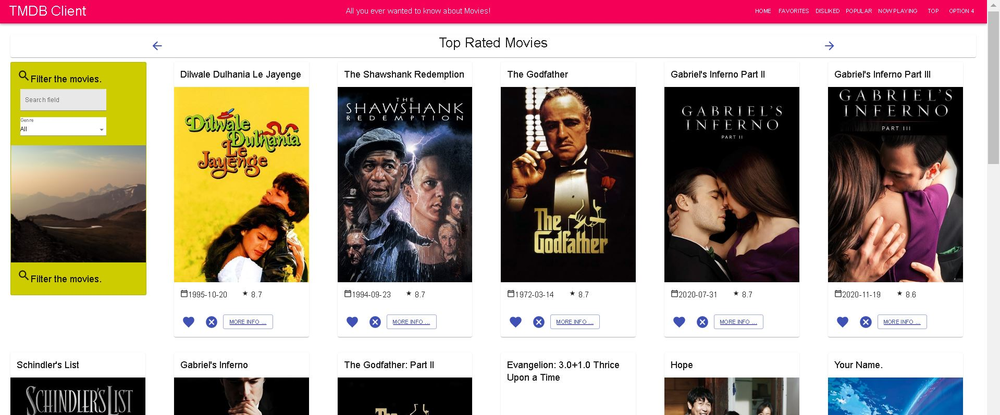
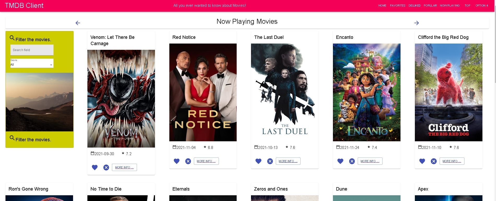

# Web-APP-Ass-1

Name: [Abaz Barami]

### Features.
+ Feature 1 - You can dislike Movies and view them on Disliked Movies Page
+ Feature 2 - A popular movies page
+ Feature 3 - A Top Rated Movies Page
+ Feature 4 - A Now Playing Movies Page

## Setup requirements.

[ npm install ]

## API endpoints.
+ https://api.themoviedb.org/3/movie/popular   - gets list of popualr movies
+ https://api.themoviedb.org/3/movie/top_rated   - gets list of top rated movies
+ https://api.themoviedb.org/3/movie/now_playing   - gets list of now playing movies

### UI Design.
The following Image is the Popular movies page. The home page is the same as this one, bar only a few movies listed near the end. 

This is the disliked movies page. When you dislike a movie, it gets added to this page. You can also undislike movies.

This is the top rated movies.

This is the now playing movies.

### Routing.

[ List the __new routes__ supported by your app and state the associated page.]

N/A
[If relevant, state what aspects of your app are protected (i.e. require authentication) and what is public.]

## Independent learning (If relevant).

[ Itemize the technologies/techniques you researched independently and adopted in your project, i.e. aspects not covered in the lectures/labs. Include the source code filenames that illustrate these (we do not require code excerpts) and provide references to the online resources that helped you (articles/blogs).

N/A
