# Web-APP-Ass-1

Name: [Abaz Barami]

## Overview

### Features.
+ Favorite Movies Page
+ Disliked Movies Page
+ Popular Movies Page
+ Top Rated Movies Page
+ Now Playing Movie Page
+ Sign up and Login
+ Search and GenreFilter
+ Movie Details

## Setup requirements.

[ npm install ]

## API endpoints.
+ https://api.themoviedb.org/3/movie/popular   - gets list of popualr movies
+ https://api.themoviedb.org/3/movie/top_rated   - gets list of top rated movies
+ https://api.themoviedb.org/3/movie/now_playing   - gets list of now playing movies

### UI Design.
>Discover Movies - Shows the movies

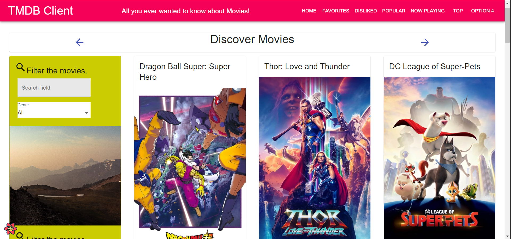

>Popular Movies - Shows the current most popular films

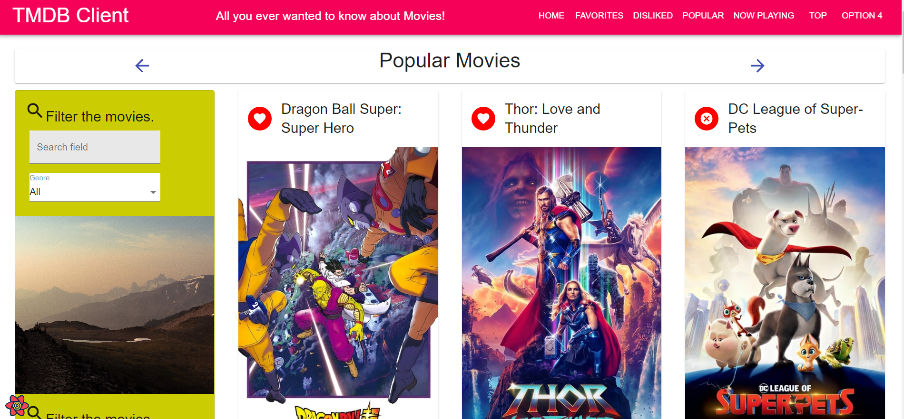

>Top Rated Movies - Shows the top rated movies

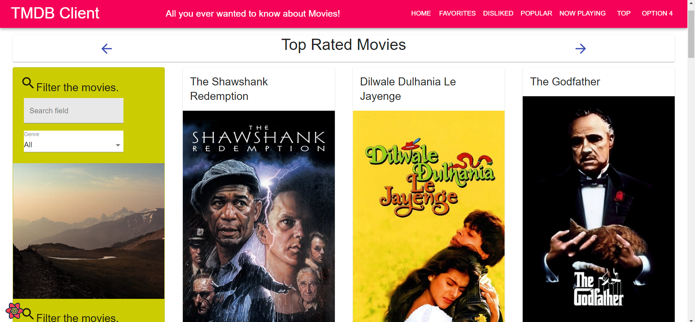

>Favorite Movies - Shows your favorite movies

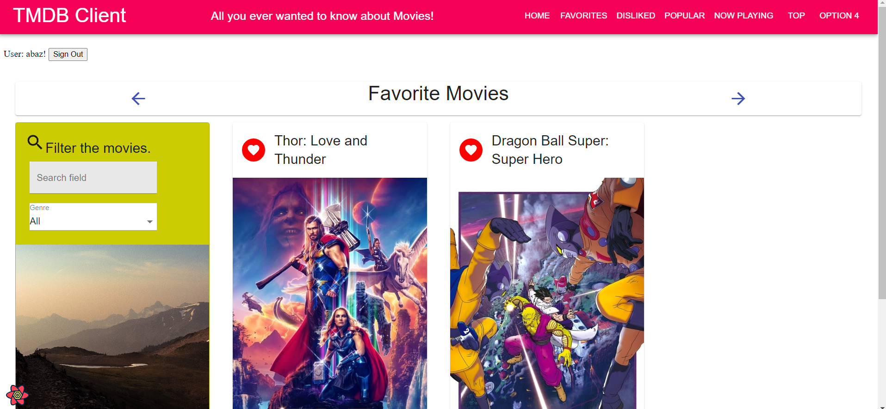

>Disliked Movies - You can dislike Movies andyou can view them on this page

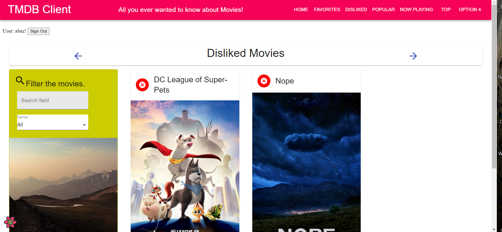

>Now Playing Movies

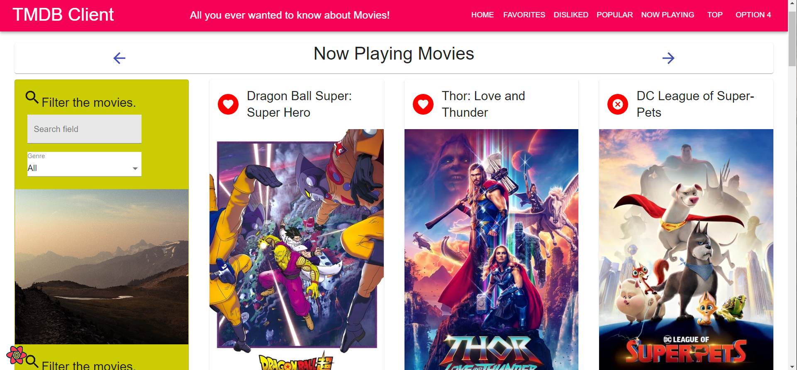

>Login

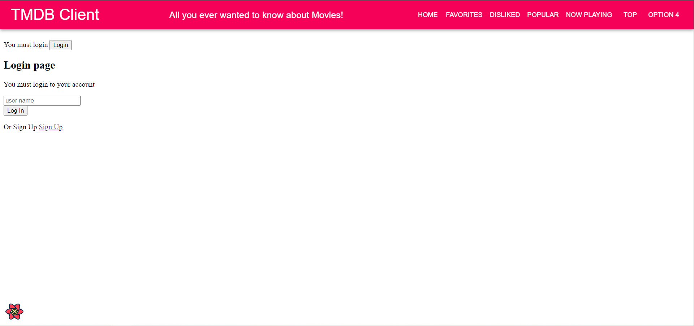

>Sign up

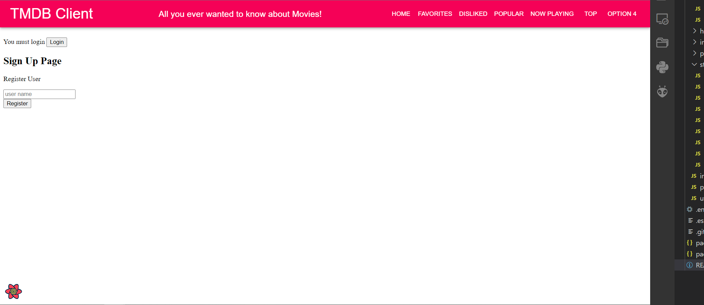

>Search Filter for Movies

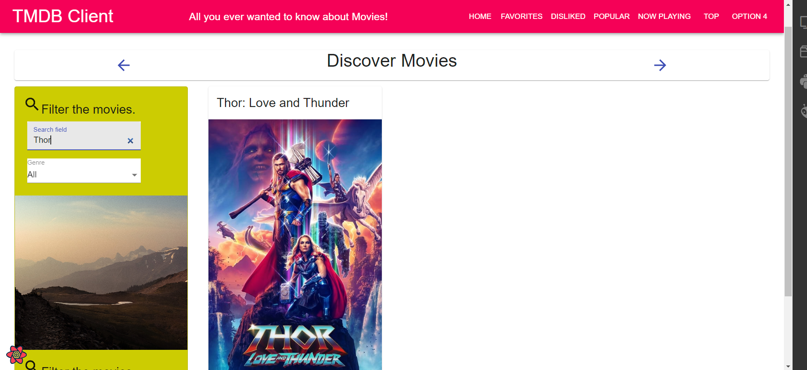

>Genre Filter for Movies

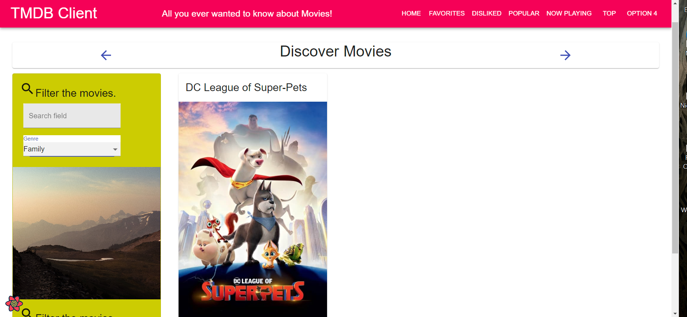

>Movie Details

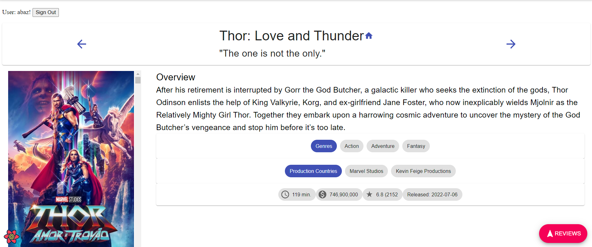

### Routing.

[ List the __new routes__ supported by your app and state the associated page.]

+ /movies/topMovies - displays top movies (private route
+ /movies/nowPlayMovie - displays now playing movies (private route)
+ /movies/disliked - displays movies you dislike
+ /login - you have to login to see movies
+ /signup - you need to sign up for an account

## Independent learning (If relevant).

[ Itemize the technologies/techniques you researched independently and adopted in your project, i.e. aspects not covered in the lectures/labs. Include the source code filenames that illustrate these (we do not require code excerpts) and provide references to the online resources that helped you (articles/blogs).

+ https://developers.themoviedb.org/3/getting-started/introduction
+ https://thecuriouscorp.com/react-login-page/
+ https://www.digitalocean.com/community/tutorials/how-to-add-login-authentication-to-react-applications